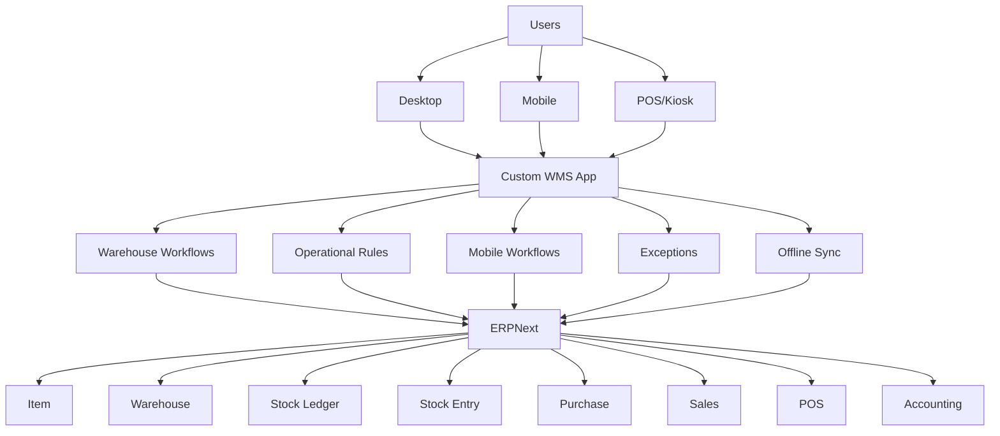

# WMS — Inventory & Warehouse Management System

## Overview

WMS is a custom Frappe application built on ERPNext v16 that provides warehouse management capabilities while keeping ERPNext as the authoritative system of record for inventory and accounting.

## Core Principle

**ERPNext remains the source of truth for inventory and accounting.**

WMS extends ERPNext with warehouse workflows, operational interfaces, and mobile capabilities without duplicating stock ledgers or accounting data.

## Current Scope

- Inventory management
- Warehouse operations
- Purchasing integration
- Sales integration
- POS integration
- Barcode scanning
- QR Code support
- RFID architecture
- Serial number tracking
- Batch/lot tracking
- UOM conversion
- Item variants
- Receiving workflows
- Putaway workflows
- Transfer workflows
- Stock count workflows
- Stock adjustment workflows
- Returns processing
- WMS reporting
- Mobile architecture
- Offline architecture (planned)

## Planned Scope

- Picking and packing workflows
- Advanced manufacturing integration
- Stock reservation
- Reorder automation
- RFID hardware integration
- Offline synchronization
- Advanced analytics
- Multi-company/customer deployment

## Architecture



## Requirements

- Frappe Framework v16
- ERPNext v16
- Python 3.10+
- Node.js 18+
- MariaDB 10.6+
- Redis/Valkey

## Installation

```bash
# Get the app
bench get-app https://github.com/silverefendy/wms.git

# Install on your site
bench --site <site-name> install-app wms

# Build assets
bench build --app wms
```

## Development Status

- **Current Phase**: Foundation / Bootstrap
- See [PROJECT_STATUS.md](PROJECT_STATUS.md) for detailed status
- See [ROADMAP.md](ROADMAP.md) for implementation phases
- See [docs/](docs/) for complete documentation

## Development Principles

1. **No Frappe core modifications** - Extend, do not modify
2. **No ERPNext core modifications** - Use standard APIs and hooks
3. **No duplicate stock ledger** - ERPNext Stock Ledger is authoritative
4. **Standard ERPNext documents** - Use existing DocTypes where possible
5. **Document architectural decisions** - All important decisions recorded as ADRs
6. **Tests required** - Non-trivial business logic must have tests
7. **Clean, minimal code** - Avoid premature abstractions and frameworks

## Documentation

- [Project Status](PROJECT_STATUS.md)
- [Roadmap](ROADMAP.md)
- [Business Requirements](docs/requirements/business-requirements.md)
- [Functional Requirements](docs/requirements/functional-requirements.md)
- [Non-Functional Requirements](docs/requirements/non-functional-requirements.md)
- [Architecture](docs/architecture/architecture.md)
- [ERPNext vs WMS](docs/architecture/erpnext-vs-wms.md)
- [Data Model](docs/architecture/data-model.md)
- [Permissions](docs/architecture/permissions.md)
- [Integration](docs/architecture/integration.md)
- [Workflows](docs/workflows/)
- [Deployment](docs/deployment/)
- [Mobile/Offline](docs/mobile/offline-sync.md)
- [Architecture Decisions](docs/decisions/)

## License

Status: Undecided. See [license.txt](wms/license.txt) for details.

## Repository

https://github.com/silverefendy/wms
