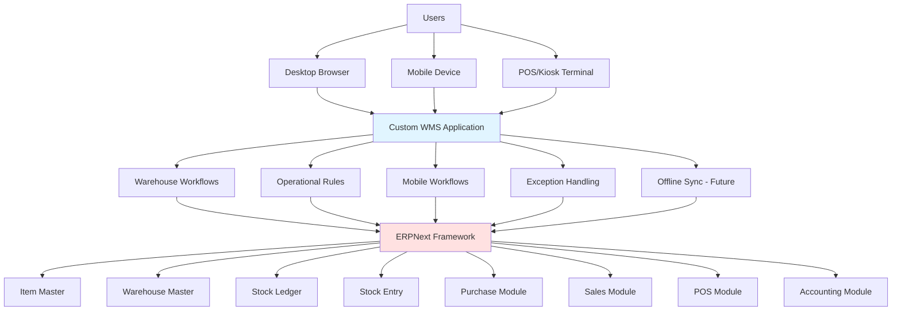

# Architecture

## System Overview

WMS is a warehouse workflow and application layer built on top of ERPNext. It does not replace ERPNext's core functionality but extends it with warehouse-specific operations.

## Architecture Diagram



## Core Principle

**WMS is a warehouse workflow/application layer on top of ERPNext.**

ERPNext remains:
- System of record for all stock balances
- System of record for accounting
- System of record for master data (Item, Customer, Supplier, etc.)

WMS provides:
- Warehouse operational workflows
- Mobile warehouse interfaces
- Exception handling
- Future offline synchronization
- WMS-specific reporting

## Layered Architecture

### Presentation Layer
- Desktop web interface
- Mobile web interface
- POS/Kiosk interface
- Future native mobile app

### Application Layer (WMS)
- Warehouse workflow orchestration
- Operational business rules
- Mobile workflow logic
- Exception management
- Offline transaction queue (future)

### Framework Layer (Frappe)
- Document management
- Permission system
- API framework
- Background jobs
- Event hooks

### Core Layer (ERPNext)
- Item management
- Warehouse management
- Stock ledger
- Stock entry
- Purchase documents
- Sales documents
- POS documents
- Accounting ledger

## Integration Points

### ERPNext Documents Used
- **Item**: Master data for products
- **Warehouse**: Storage location definition
- **Stock Entry**: Stock movement transactions
- **Stock Ledger**: Stock balance tracking
- **Purchase Order/Receipt**: Purchasing integration
- **Sales Order/Delivery**: Sales integration
- **POS Invoice**: POS integration
- **Accounting Entries**: Financial integration

### WMS Extensions
- Custom warehouse location hierarchy (Zone, Aisle, Rack, Shelf, Bin)
- Warehouse workflow documents
- Mobile-specific interfaces
- Exception handling workflows
- Future offline synchronization

## Data Flow

### Inbound Flow
```
Purchase Order (ERPNext)
  ? Purchase Receipt (ERPNext)
  ? Receiving Workflow (WMS)
  ? Putaway Workflow (WMS)
  ? Stock Entry (ERPNext)
  ? Stock Ledger (ERPNext)
```

### Internal Flow
```
Transfer Request (WMS)
  ? Stock Entry (ERPNext)
  ? Stock Ledger (ERPNext)
```

### Outbound Flow
```
Sales Order (ERPNext)
  ? Picking Workflow (WMS)
  ? Packing Workflow (WMS)
  ? Delivery Note (ERPNext)
  ? Stock Entry (ERPNext)
  ? Stock Ledger (ERPNext)
```

## Technology Stack

### Backend
- Frappe Framework v16
- Python 3.10+
- MariaDB 10.6+
- Redis/Valkey

### Frontend
- Frappe UI framework
- Vue.js (via Frappe)
- Bootstrap (via Frappe)

### Infrastructure
- Ubuntu Linux
- VMware virtualization
- Nginx (web server)

## Design Principles

1. **No Core Modifications**: Extend Frappe/ERPNext, do not modify core
2. **Single Source of Truth**: ERPNext owns stock and accounting data
3. **Standard APIs**: Use Frappe APIs for all data access
4. **Document-Driven**: Leverage Frappe document system
5. **Hook-Based**: Use Frappe hooks for extensions
6. **Minimal Custom DocTypes**: Only create when genuinely needed
7. **Clean Separation**: Clear boundary between WMS and ERPNext

## Security Architecture

- Frappe role-based access control
- Document-level permissions
- Field-level permissions where needed
- Audit trail for all operations
- API authentication via Frappe

## Performance Considerations

- Database indexing for common queries
- Caching for frequently accessed data
- Batch operations for bulk updates
- Efficient stock ledger queries
- Mobile-optimized API responses
