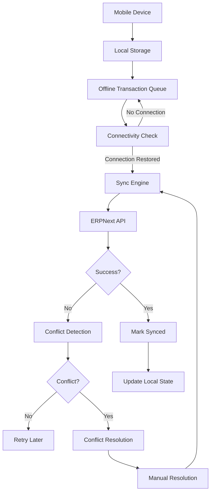

# Offline Synchronization Architecture

## Purpose
Enable warehouse operations to continue during network outages and synchronize data when connectivity is restored.

## Current Status

**Status: Not Implemented**

This is a future capability planned for Phase 7. The architecture is documented here for future implementation.

## Architecture Overview

## Offline Operation

### Local Storage
- IndexedDB or SQLite for local data storage
- Cache reference data (Items, Locations, etc.)
- Store offline transactions
- Maintain sync state

### Transaction Queue
- FIFO queue for offline transactions
- Each transaction has unique ID
- Timestamp for ordering
- Operation type (receive, putaway, transfer, etc.)
- Data payload

### Reference Data Sync
- Download reference data before going offline
- Items, warehouses, locations, users
- Periodic refresh when online
- Conflict detection for reference data changes

## Synchronization

### Sync Trigger
- Connectivity restored
- Periodic sync when online
- Manual sync request
- Queue size threshold

### Sync Process

1. **Connectivity Check**
   - Detect network availability
   - Test ERPNext connectivity
   - Verify authentication

2. **Queue Processing**
   - Process transactions in order
   - Submit to ERPNext API
   - Handle responses

3. **Success Handling**
   - Mark transaction as synced
   - Update local state
   - Remove from queue
   - Update sync timestamp

4. **Error Handling**
   - Log error details
   - Keep transaction in queue
   - Schedule retry
   - Notify user if critical

## Conflict Detection

### Conflict Types

#### Duplicate Transaction
- Same transaction ID already processed
- May indicate duplicate submission
- Check transaction status in ERPNext

#### Data Conflict
- Reference data changed since sync
- Item modified/deleted
- Location modified/deleted

#### Business Rule Conflict
- Stock quantity changed
- Item already transferred
- Document already processed

### Conflict Detection Strategy

#### Optimistic Concurrency
- Assume no conflicts during offline
- Detect conflicts during sync
- Resolve conflicts when detected

#### Version Checking
- Include version/timestamp in offline data
- Compare with server version on sync
- Flag if versions differ

#### State Validation
- Validate current state before applying offline transaction
- Check if preconditions still hold
- Reject if state changed

## Conflict Resolution

### Automatic Resolution

#### Duplicate Detection
- Check if transaction already processed
- If processed, skip and mark synced
- If failed, retry

#### Idempotent Operations
- Design operations to be idempotent
- Same operation can be applied multiple times safely
- Use unique transaction IDs

### Manual Resolution

#### User Notification
- Alert user to conflict
- Show conflict details
- Provide resolution options

#### Resolution Options
- **Retry**: Attempt sync again
- **Override**: Force apply offline transaction
- **Discard**: Cancel offline transaction
- **Modify**: Edit transaction before retry

#### Resolution Workflow
1. User reviews conflict
2. User selects resolution
3. System applies resolution
4. System updates sync state
5. System logs resolution

## Transaction IDs

### ID Generation
- UUID for each transaction
- Generated on device
- Guaranteed unique across devices
- Included in all sync requests

### ID Tracking
- Local transaction ID
- Server transaction ID (after sync)
- Mapping between local and server IDs
- Used for duplicate detection

## Idempotency

### Idempotent Design
- Operations can be safely retried
- Same operation multiple times = same result
- Critical for offline sync reliability

### Implementation
- Use unique transaction IDs
- Check if already processed before applying
- Return success if already processed
- Only modify state if not already modified

## Timestamps

### Local Timestamp
- When transaction created on device
- Used for ordering
- Used for conflict detection

### Server Timestamp
- When transaction processed on server
- Used for audit trail
- Used for sync verification

### Clock Skew
- Handle device clock differences
- Use server time as authoritative
- Allow reasonable skew tolerance

## Sync Status

### Status Values
- **Pending**: Transaction queued, not synced
- **Syncing**: Currently being synced
- **Synced**: Successfully synced
- **Failed**: Sync failed, will retry
- **Conflict**: Conflict detected, needs resolution
- **Discarded**: User discarded transaction

### Status Tracking
- Per-transaction status
- Overall sync status
- Last successful sync timestamp
- Sync failure count

## Audit Trail

### Offline Audit
- Record all offline transactions
- Record sync attempts
- Record conflicts
- Record resolutions

### Sync Audit
- Record all sync operations
- Record sync success/failure
- Record conflict resolutions
- Record data modifications

### Audit Requirements
- What happened
- When happened
- Who performed operation
- Transaction ID
- Sync status
- Conflict details
- Resolution details

## Performance Considerations

### Batch Size
- Process transactions in batches
- Configurable batch size
- Balance speed vs reliability

### Throttling
- Don't overwhelm server
- Respect rate limits
- Adaptive throttling based on response time

### Delta Sync
- Only sync changed data
- Minimize data transfer
- Reduce sync time

## Security

### Data Encryption
- Encrypt local storage
- Encrypt data in transit
- Secure encryption keys

### Authentication
- Re-authenticate on sync
- Token refresh
- Handle expired tokens

### Access Control
- Respect user permissions offline
- Sync respects server permissions
- Audit offline access

## Error Handling

### Transient Errors
- Network timeout
- Server temporarily unavailable
- Retry with exponential backoff

### Permanent Errors
- Authentication failure
- Permission denied
- User intervention required

### Error Recovery
- Automatic retry for transient errors
- User notification for permanent errors
- Fallback to manual sync if needed

## Testing

### Offline Testing
- Test offline operations
- Test queue management
- Test local storage

### Sync Testing
- Test sync process
- Test conflict detection
- Test conflict resolution

### Integration Testing
- Test with real ERPNext
- Test with network interruptions
- Test with concurrent users

## Implementation Phases

### Phase 1: Basic Offline
- Local storage
- Transaction queue
- Basic sync

### Phase 2: Conflict Detection
- Version checking
- State validation
- Conflict notification

### Phase 3: Conflict Resolution
- Manual resolution UI
- Resolution options
- Resolution workflow

### Phase 4: Advanced Features
- Delta sync
- Batch optimization
- Advanced conflict resolution
